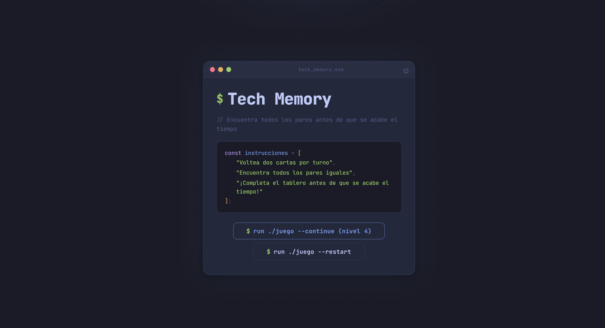
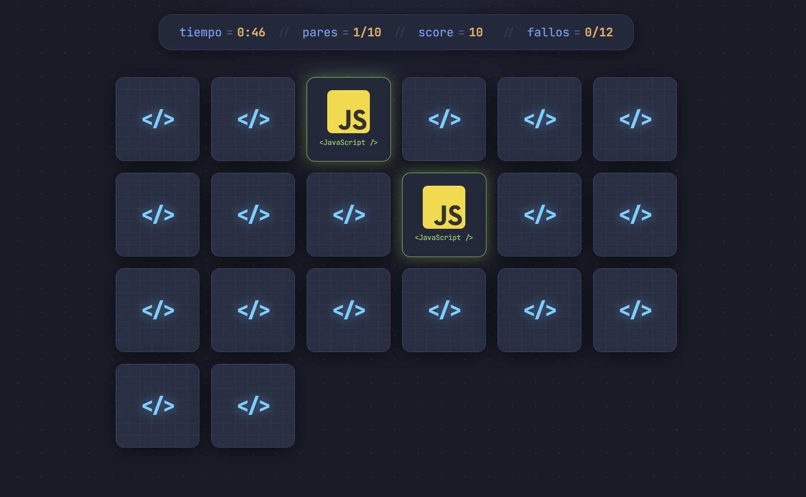
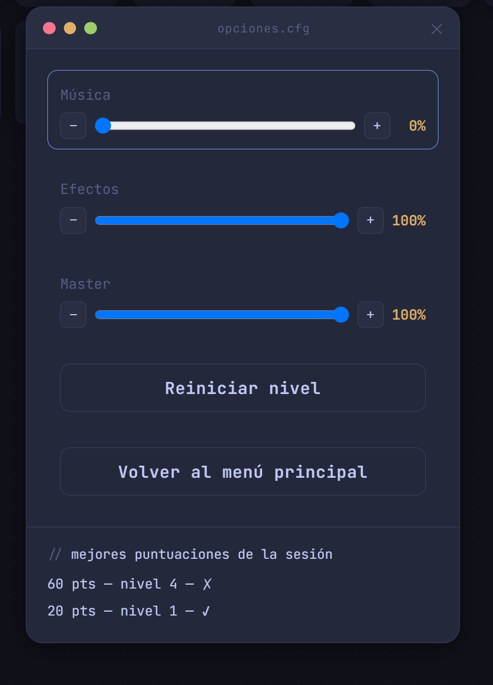
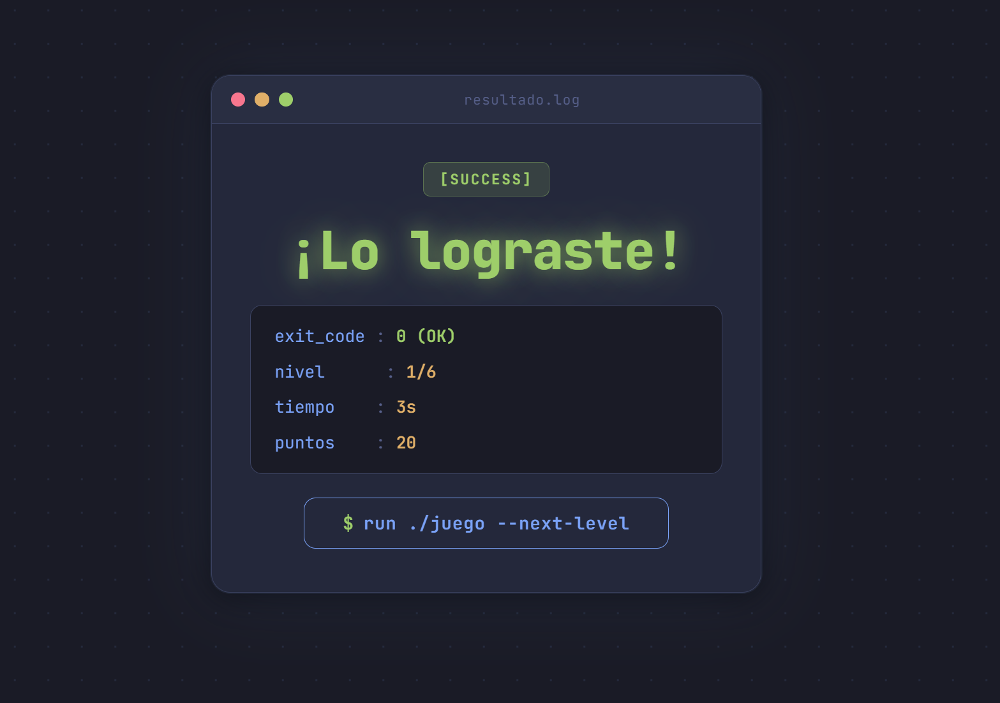
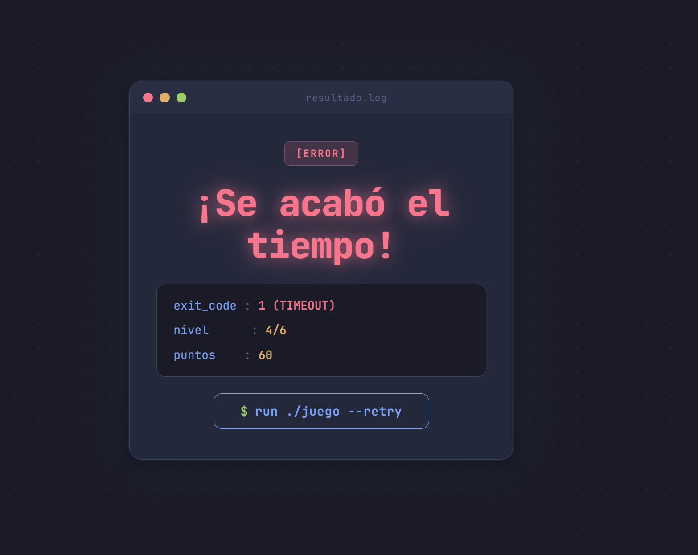

# Tech Memory — Juego de Memoria

Proyecto Personal · IF7102 Multimedios · UCR Sede Regional de Guanacaste · I Ciclo 2026

**Framework:** Vue 3 (Composition API) + Vite
**Opción elegida:** 5 — Juego Educativo de Un Nivel
**Tipo de juego:** Memoria con pares imagen + sonido

---

## Descripción

Tech Memory es un juego de memoria ambientado en una terminal de desarrollador: ventanas con
botones de semáforo, tipografía monoespaciada (JetBrains Mono) y una paleta de colores tipo
Tokyo Night, igual a la que usaría cualquier editor de código. En lugar de figuras genéricas, las
cartas muestran logos de lenguajes, frameworks, bases de datos y asistentes de IA (Vue, React,
Angular, Python, Java, PHP, MySQL, ChatGPT, Claude, Gemini, entre otros), así que el jugador en
realidad está memorizando posiciones de un "stack tecnológico" completo.

El juego tiene 6 niveles de dificultad progresiva: cada nivel aumenta la cantidad de pares,
reduce el tiempo de vista previa y el tiempo total disponible, y a partir del nivel 3 introduce un
límite de fallos permitidos. El progreso (último nivel alcanzado) se guarda en `localStorage`, así
que el jugador puede continuar donde quedó o reiniciar desde cero.

Además del juego en sí, la aplicación incluye un panel de opciones completo —volumen de música,
volumen de efectos, volumen maestro y un historial de mejores puntuaciones de la sesión— navegable
tanto con mouse como con teclado (flechas/WASD, Enter/Espacio y Tab), accesible desde la pantalla
de inicio y también durante una partida en curso (donde además permite reiniciar el nivel o volver
al menú principal sin perder el tiempo transcurrido).

---

## Capturas de pantalla

**Pantalla de inicio** — terminal de bienvenida con las instrucciones del juego y la opción de
continuar en el nivel guardado o reiniciar desde el nivel 1.



**Tablero de juego** — HUD con tiempo restante, pares encontrados, puntaje y contador de fallos;
las cartas muestran el logo de la tecnología al voltearse.



**Panel de opciones** — control de volumen de música, efectos y volumen maestro, botones de
reiniciar nivel / volver al menú (disponibles solo dentro de una partida), e historial de
puntuaciones de la sesión.



**Resultado — victoria** — se muestra el nivel superado, el tiempo usado y los puntos obtenidos.



**Resultado — derrota** — el juego distingue si se perdió por tiempo agotado o por exceso de
fallos, y permite reintentar el mismo nivel.



---

## Funcionalidades principales

- **6 niveles de dificultad** con progresión de pares, tiempo, vista previa y límite de fallos.
- **Vista previa de cartas** al iniciar cada nivel/reinicio: las cartas se muestran brevemente
  antes de ocultarse, con un parpadeo que se acelera/reduce según el nivel.
- **Persistencia de progreso** en `localStorage`: el nivel alcanzado se recuerda entre sesiones.
- **Audio integrado**: música de fondo distinta para juego/victoria/derrota, y efectos de sonido
  para voltear carta, acierto, error, puntos y fin de tiempo.
- **Panel de opciones** con volumen de música, efectos y volumen maestro (que atenúa ambos a la
  vez sin alterar los valores individuales guardados), navegable 100% por teclado o mouse.
- **Historial de puntuaciones** de la sesión actual, visible dentro del panel de opciones.
- **Reiniciar nivel / volver al menú** desde dentro de una partida, sin perder el progreso de
  niveles ya superados.
- **Diseño responsive**: el tablero y la interfaz se adaptan a pantallas de escritorio y móvil.
- **Datos cargados dinámicamente** desde un archivo JSON (`public/data/cards.json`) con `fetch()`.

---

## Niveles de dificultad

| Nivel | Pares | Tiempo total | Vista previa | Intervalo de parpadeo | Límite de fallos |
|------:|------:|-------------:|-------------:|-----------------------:|-------------------:|
| 1     | 2     | 60 s         | 12 s          | 500 ms                 | Sin límite          |
| 2     | 4     | 60 s         | 10 s          | 500 ms                 | Sin límite          |
| 3     | 5     | 55 s         | 8 s           | 500 ms                 | 15                  |
| 4     | 10    | 50 s         | 6 s           | 400 ms                 | 12                  |
| 5     | 15    | 45 s         | 4 s           | 300 ms                 | 9                   |
| 6     | 20    | 40 s         | 2.5 s         | 250 ms                 | 6                   |

Definidos en `src/levels.js`.

---

## Instalación y ejecución

Requiere Node `^20.19.0` o `>=22.12.0`.

```sh
pnpm install
pnpm dev
```

El proyecto corre en `http://localhost:5173` por defecto (Vite usa el siguiente puerto libre si
ese ya está ocupado).

> El proyecto está construido sobre Vite, así que también funciona con `npm install` y
> `npm run dev` si no se tiene `pnpm` instalado.

Otros comandos disponibles:

```sh
pnpm build       # build de producción
pnpm preview     # sirve el build de producción localmente
pnpm test:unit   # corre la suite de pruebas con Vitest
```

---

## Pruebas automatizadas

El proyecto incluye pruebas unitarias y de componentes con **Vitest** + **@vue/test-utils**,
cubriendo los composables (`useAudioSettings`, `useScoreHistory`), el reproductor de audio, el
panel de opciones, la pantalla de inicio, el tablero de juego y la integración completa en
`App.vue`. Al momento de esta entrega: **7 archivos de prueba, 31 pruebas, todas en verde**.

```sh
pnpm test:unit
```

---

## Estructura del proyecto

```
src/
├── assets/
│   ├── main.css                # Variables CSS (paleta Tokyo Night) y estilos globales
│   └── images/                 # Capturas de pantalla usadas en este README
├── components/
│   ├── StartScreen.vue         # Pantalla de inicio
│   ├── GameBoard.vue           # Tablero del juego: temporizador, vista previa, HUD
│   ├── MemoryCard.vue          # Carta individual (reutilizable)
│   ├── ResultScreen.vue        # Pantalla de resultados (victoria/derrota)
│   ├── SettingsPanel.vue       # Panel de opciones: volumen, historial, reiniciar/salir
│   └── AudioPlayer.vue         # Reproductor de audio (reutilizable)
├── composables/
│   ├── useAudioSettings.js     # Estado compartido de volumen (música/efectos/maestro)
│   └── useScoreHistory.js      # Historial de puntuaciones de la sesión
├── __tests__/                  # Pruebas unitarias y de componentes (Vitest)
├── levels.js                   # Configuración de los 6 niveles de dificultad
├── App.vue                     # Raíz: estado global, navegación entre pantallas
└── main.js                     # Punto de entrada de la app

public/
├── data/
│   └── cards.json              # Datos del juego (pares y rutas de audio), cargado con fetch
├── images/                     # Logos de tecnologías usados en las cartas
├── audio/                      # Efectos de sonido (.mp3)
└── music/                      # Música de fondo por estado del juego (.mp3)
```

---

## Medios incluidos

| Archivo / recurso | Descripción | Fuente | Licencia |
|---|---|---|---|
| `public/audio/*.mp3` (5 efectos: cardflip, error, points, timeup, winning) | Efectos de sonido del juego | [Mixkit — Free Sound Effects](https://mixkit.co/free-sound-effects/) | Mixkit Free License (uso libre, sin atribución obligatoria) |
| `public/music/*.mp3` (during_game, after_winning, after_losing) | Música de fondo por estado del juego | [Mixkit — Free Stock Music](https://mixkit.co/free-stock-music/) | Mixkit Free License (uso libre, sin atribución obligatoria) |
| `public/images/*.png` (21 logos de tecnologías y asistentes de IA) | Íconos usados en las cartas del juego | [Devicon](https://devicon.dev/) | MIT License |
| Fuente "JetBrains Mono" | Tipografía monoespaciada de toda la interfaz | [Google Fonts](https://fonts.google.com/specimen/JetBrains+Mono) | SIL Open Font License |

Detalle completo de fuentes y documentación consultada en [`REFERENCIAS.md`](./REFERENCIAS.md).

---

Estudiante: Aaron Salazar Mata
